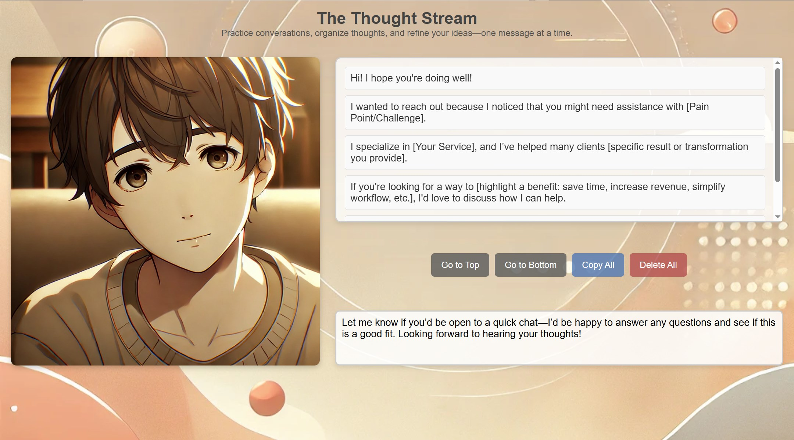

# The Thought Stream 🌊💭  
**A useful web-based tool I made that allows you to practice writing to someone and copy what you told them to paste elsewhere. Useful for visualizing yourself teaching someone or offering services to them. Allows you to internalize what you need to reiterate over or focus more on before you have the same talk with a real person.**

---

## 📸 Demo Screenshot  


---

## 📖 About  
The **Thought Stream** is a simple but effective **web-based tool** for practicing conversations, writing out thoughts, and refining communication. It lets you:
- **Write and save messages** in a structured way.
- **See previous messages** in a stacked format.
- **Copy all messages at once** for easy pasting elsewhere.
- **Delete messages when you're ready to reset.**

This is great for **practicing pitches, teaching concepts, or organizing thoughts** before a real discussion.

---

## 🚀 Features  
✅ **Write and save text easily**  
✅ **Copy all text with one button**  
✅ **Delete messages when needed**  
✅ **Smooth scrolling for navigation**  
✅ **Mobile-friendly & responsive**  
✅ **Lightweight and easy to use**  

---

## 🛠️ How to Download and Run  
1. **Download the repository**  
   - Click the **"Code"** button on the repo page and select **Download ZIP**.  
   - Extract the ZIP file to a folder on your computer.  
2. **Open the application**  
   - Locate the `index.html` file inside the extracted folder.  
   - Double-click `index.html` to open it in your browser.  
3. **Start using The Thought Stream!** 🎉 

Alternatively, if you have **Git installed**, you can clone the repository:  
```sh
 git clone https://github.com/RuneMeUp99/thought-stream.git
 cd thought-stream
 open index.html
```

---

## 🎨 Tech Used  
- **HTML5** - Page structure  
- **CSS3** - Styling & responsiveness  
- **JavaScript** - Dynamic text handling & local storage  

---

## 🏷️ License  
This project is **open-source** under the **MIT License**.  

---

## 👤 Author  
- **Christian Hatton** ([RuneMeUp99](https://github.com/RuneMeUp99))  
- **GitHub Repo:** [Thought Stream](https://github.com/RuneMeUp99/thought-stream/)  

---

🎉 **Use The Thought Stream to sharpen your communication skills!** 🚀

